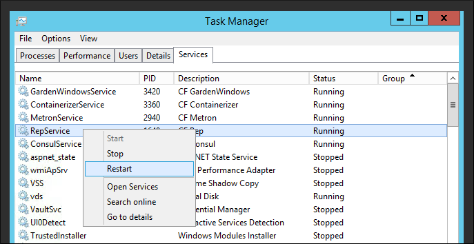
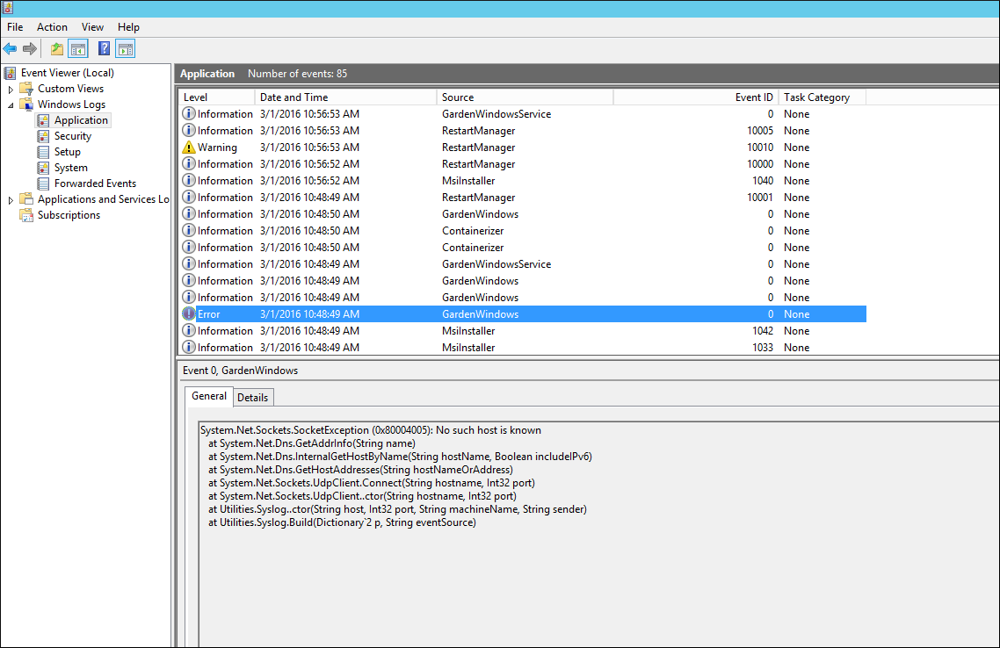

# Troubleshooting Diego for Windows

This topic describes how to troubleshoot a Windows cell in a Diego deployment.

##Resolve Application Errors

Make sure that your .NET app is ready for deployment. You usually see the following errors right after pushing an app. 

###NoCompatibleCell

This error has two root causes. Either:
- There is no available capacity on the cells. For example, you may be pushing an application requesting 2GB of memory when there is no available Windows cell with capcacity for a 2GB application.
- Or the RepService has not yet registered your Windows cell with the rest of your Cloud Foundry (CF) deployment. The RepService attempts to reconnect on an interval, and can sometimes resolve itself within a few minutes.
 
To resolve the first error, try reducing the resource requirements of your app, adding additional cells, or removing or reducing the resource requirements of other deployed applications.

To resolve the second error, you can restart the RepService within the cell to trigger an immediate reconnection:

###Start Unsuccessful

This error is usually indicates that your app is misconfigured for your CF Windows environment. 

* Push your app from a directory containing either a `.exe` binary or a valid `Web.config` file for .NET apps. 

* Or, add the `-p` flag to your `cf push` command and specify the path to the directory that contains the `.exe` or `Web.config` file.

This error can also indicate your app does not contain the required `.dll`s and dependencies. 

* Ensure that your app dependencies are contained in your pushed app.

##Find Errors with Hakim

Hakim is a diagnostic tool that reveals common configuration issues with Windows cells.

###Install and Run Hakim

1. Download the `hakim.exe` corresponding to your installed DiegoWindows version from the GitHub [release page](https://github.com/cloudfoundry/diego-windows-release/releases).

2. From the command prompt, navigate to the directory that contains the downloaded binary.

3. Execute the binary. Here is example hakim output:

	<pre class='terminal'>
		PS C:\Users\Administrator\Downloads> .\hakim.exe
		2016/02/26 21:04:35 The following processes are not running: garden-windows.exe
		2016/02/26 21:04:36 Failed to create container
		Post http://api/containers: dial tcp 127.0.0.1:9241: ConnectEx tcp: No connection could be made because the target machine actively refused it.
	</pre>

###Resolve Common Errors

Hakim only outputs to the console if it detects errors. Here are some common errors and resolutions:

- `The following processes are not running:` This usually indicates a failed deployment. Re-provision your Windows components. If this does not fix this issue, contact support with the exact deployment steps followed and version of CF deployed.

- `Failed to resolve consul host` This usually indicates interference with DNS resolution on your Windows cell. To resolve this error, set localhost 127.0.0.1 as the primary DNS server for the active network adapter.

- `Fair Share CPU Scheduling must be disabled` You must disable this setting for your Windows cell to function properly. Turn this off through the **Group Policy Management** console, and then restart your Windows cell.

- `Windows firewall service is not enabled` The DiegoWindows product enforces CF security group settings for apps running on the cell through the Windows firewall. Apps can run without this, but security groups do not work correctly and apps have unrestricted network access.

- `There was an error detecting ntp synchronization on your machine` Clock skew with other CF components can occur if NTP is not configured. Clock skew can result in odd errors, for example not receiving any application metrics for apps running on the affected machine.
For your Windows cell, use the same NTP server as the rest of your CF deployment.

- `Logon failure: the user created by Containerizer has not been granted the requested logon type at this computer. Local accounts require permissions to logon locally.` The container users created by DiegoWindows need the privilege to log on locally. Granting the `IIS_IUSRS` group the ["Allow log on locally"](https://technet.microsoft.com/en-us/library/cc756809(v=ws.10).aspx) privilege will resolve this error.

- `Failed to create container` This usually indicates an issue with the Windows containerization service. Contact support and provide the full output of this error.

- `NoCompatibleCell` when pushing an application. In addition to the root causes listed above, this could also be an issue with the registration of the Consul service due to bad certificates on the Cell (e.g. due to a CF redeploy).
In this scenario, the Consul service will be seen as repeatedly restarting (as seen in Task Manager), and a directory will be visible either at `%WINDIR%\Temp\serf` or `%PROGRAMDATA%\ConsulService\serf` with some CF certificates. 
The issue can be resolved by deleting this directory, re-running `generate.exe` and uninstalling and re-installing the MSI installers. (This directory is cleaned up automatically by the uninstall process as of [this commit](https://github.com/cloudfoundry/diego-windows-release/commit/53c423f70478d7b3641ac0b96f6fe9b36af5d404)).

##Troubleshoot Other Issues

- Trying to debug or investigate a DNS issue? Try using both `ping.exe` and `nslookup.exe`. `nslookup` suffers from an issue of only using a single DNS server, so it may report failures that are not "real".

- `The stack could not be found` error.
This error occurs on application push, and provides CLI output similar to the follwing:

	<pre class='terminal'>
	Starting app mytestapp in org ORG / space SPACE as admin...
	FAILED
	Server error, status code: 404, error code: 250003, message: The stack could not be found: The requested app stack windows2012R2 is not available on this system.
	</pre>
This error is resolved by enabling Diego for the application `cf enable-diego APPNAME`. The application must be stopped (or pushed with `--no-start`) before enabling Diego, and then manually starting the application.

- Application failed to stage:
	<pre class='terminal'>
	Starting app myApp in org ORG / space SPACE as admin...
	FAILED
	StagingError
	<...>
	[API/0] ERR Failed to stage application: staging failed
	</pre>
This error is often caused by a mismatch between the version of DiegoWindows that is installed on the cell and the version of Diego or Elastic Runtime. 

- Unexpected flapping of applications:
  An application may start and then unexpectedly restart due to duplicate cell hostnames. Diego components rely on a unique hostname to communicate with each other. The `hostname` command will show the currently configured name.

##Collecting Additional Diagnostic Information

Look at the **Event Viewer** logs in Windows to troubleshoot other issues:

1. Navigate to **Windows Logs** > **Application**. 

1. Review log messages from the services running in DiegoWindows. 

1. To isolate the issue, clear the log, reproduce the issue, and review the latest messages. 

1. Include the content of these messages in your support request if you need to contact support.

